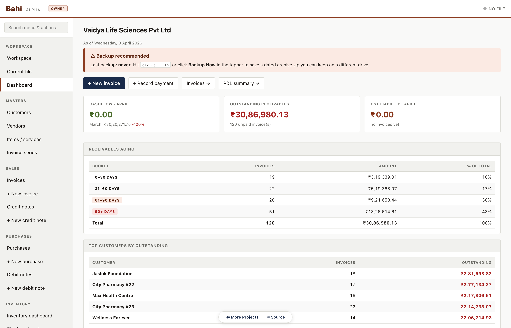

<h1 align="center">Bahi</h1>

<p align="center"><b>Double-entry books for an Indian business in one browser tab: invoices, GST returns, TDS and TCS, inventory and your CA's review, kept in one file on your own disk.</b></p>

<p align="center">One HTML file. Chrome, Edge, Brave, Arc or Opera. No account, no server, no telemetry.</p>

<p align="center">
  <a href="https://bahi.naklitechie.com"></a>
  
  
  <a href="agent/AGENT.md"></a>
</p>

<p align="center"></p>

## Install

| Where | How |
|---|---|
| Any Chromium browser | Open <https://bahi.naklitechie.com> |
| Your own machine | Clone the repo, run `python3 -m http.server 8080` in it, open <http://localhost:8080> |

Open it and choose **Workspace → Create new .khata**. Give the company its name and GSTIN, and pick where the file goes; the state fills itself from the GSTIN. From the first invoice on, every post is written to that file on your disk, and nowhere else. An agent in the same tab can start with:

```js
await window.bahi.call('describe_tools')   // the 83 tools, their inputs, and what stays with you
```

No config, no sign-up, no sync service. To look before you commit, open one of the synthetic books in [`sample-data/`](sample-data/): `pharma.khata` holds two financial years of invoices, purchases, receipts, credit notes, TDS and stock.

## Why

Your books sit in someone else's cloud, priced per user per year, and leaving means an export that nothing reads back in. Your CA asks for a Tally backup, and you are never sure which copy is current.

Bahi keeps the books in one `.khata` file: a zip holding a SQLite double-entry ledger, a hash-chained and signed audit log, and in-file snapshots. You own the file, you back it up, and any SQLite tool can open it. It is built for India: GST with CGST, SGST and IGST routing, GSTR-1 and GSTR-3B, TDS and TCS returns, CMP-08, and an April-to-March year. It runs one office at a time and needs a Chromium browser; e-invoicing (IRN) is not built.

## Your file, and your CA

The `.khata` format is specified in [`khata-format.md`](khata-format.md). Every save keeps the previous state as a snapshot inside the file, **Backup Now** (`Ctrl+Shift+B`) writes a dated archive with the audit log as CSV, and a file from a newer Bahi opens read-only rather than being rewritten. Every post lands in an append-only audit log whose entries are hash-chained and signed, so an edit made outside Bahi breaks the chain; the Debug Console's integrity check and the `verify_integrity` tool both report it.

In CA mode (`Ctrl+Shift+M`) your CA reviews entries, leaves annotations and posts adjustments under their own membership number. Filed GST periods lock, and the year closes through a rollover that carries balances forward. Tally users bring their history in through **Tally XML import**; SAP B1 users get a DTW export and import.

## Letting an agent help

The same 83 tools the screens post through are open to an agent in the tab: through WebMCP when the browser offers it, through `window.bahi`, or from another tab once you open that door in **Settings → Agent access**. An agent reads freely. Anything that changes the books arrives as a proposal under the agent button in the header, and nothing posts until you approve it. Opening books, closing the year, locking periods, CA sign-off, imports, backups and raw SQL stay with you. The contract is [`agent/AGENT.md`](agent/AGENT.md).

## Commands

```text
F8 · F9                 new sales invoice · new purchase
F5 · F6 · F4/F7         payment · receipt · journal voucher
F1 · F3                 switch company · company info
Ctrl+A                  accept and save the current form
Ctrl+Z                  undo your last post (a counter-entry; the original stays in the log)
Ctrl+Shift+B            Backup Now
Ctrl+Shift+M            switch between Owner and CA mode
Ctrl+Shift+D            Debug Console
Ctrl/Cmd+Shift+L        CA Lookup (on-device tax reference search)
?                       every shortcut, with a printable cheat sheet
```

From a script or an agent, `window.bahi.call(name, args)` reaches every tool; `window.bahi.manifest()` returns the published contract, also at [`agent/manifest.json`](agent/manifest.json).

## Verify it yourself

```bash
cd sample-data && python3 -m unittest discover            # 53 tests on the .khata format and the sample books
cd agent/harness && npm install && npx playwright install --only-shell chromium
node checks.mjs                                           # 55 checks, driving the real app headless, in IST
node prove-red.mjs                                        # reintroduces each defect; each check must go red
node lint-agent-face.mjs && node test-lint-agent-face.mjs # every write owned; the lint catches six planted faults
```

The checks refuse a ledger that does not balance, a day book that does not partition into its months, GST figures that disagree between GSTR-1, GSTR-3B and the sales register, stock movements that do not sum to stock on hand, and a form that posts by a path of its own. Every check has been seen to fail: `prove-red.mjs` breaks the code each check guards and requires the check to notice. The form-and-agent pairs for invoices and purchases are verified to write identical rows, differing only in who the audit log names.

## License

No license chosen yet.

[The `.khata` format](khata-format.md) · [The agent contract](agent/AGENT.md) · [Features and design decisions](docs/FEATURES.md) · [Getting started](docs/getting-started.md) · [CA guide](docs/ca-guide.md) · [Tally migration](docs/tally-migration.md) · [Walkthrough](https://bahi.naklitechie.com/demo/)
